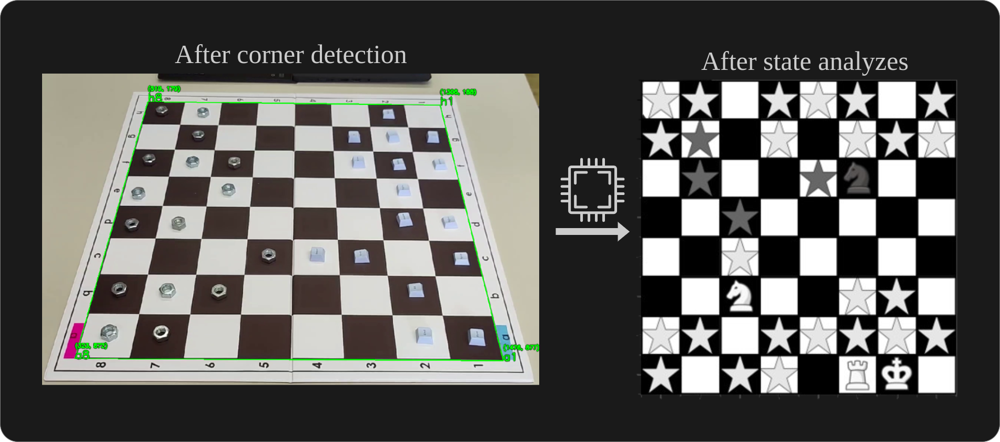
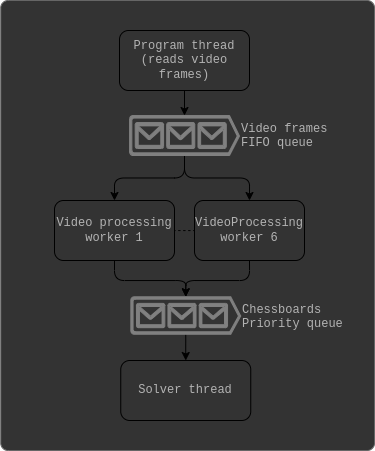

 ```
   _____ _                                _                
  / ____| |                              | |               
 | |    | |__   ___  ___ ___    ___  ___ | |_   _____ _ __ 
 | |    | '_ \ / _ \/ __/ __|  / __|/ _ \| \ \ / / _ \ '__|
 | |____| | | |  __/\__ \__ \  \__ \ (_) | |\ V /  __/ |   
  \_____|_| |_|\___||___/___/  |___/\___/|_| \_/ \___|_|
```


<div style="display: flex; justify-content: space-around; align-items: center;">
    
</div>

## Description
- The goal of the project is to analyze a chess game from a **fixed or moving** video.
- The white and black pieces are **replaced by two random objects** (e.g. red capsules for white, blue keycaps for black), making the task more challenging.
- The program starts without knowing the object assigned to each team and must work from any starting position, i.e., the pieces do not start in the standard position and can be shuffled around the board making the task really hard.
- A short report can be found [here](report.pdf).
## Method
- Chessboard features localization:
  - **Read video**: 4 frames / second are extracted form the video and put in a queue.
  - **Detect stickers**: The stickers are detected using a mask on a hsv version of the frame. The stickers are there to help us determine the orientation of the board on moving videos.
  - **Detect black square**: The black squares are
    identified using thresholding, opening, contour
    detection and filtering the contours found. 
  - **Detect corners**: Using the black squares, the
    diagonal a1-h8 is detected. We can assign each
    black square center a position in the chessboard
    using the homography of the corners of a1 and
    a8. That gives us enough points to compute the
    homography to find the corners.
  - **Assign corners**: To assign the corners to their
    respective position (a1, a8, h1, and h8), we use
    the stickers detected previously. We draw a line
    between the two stickers and a perpendicular one
    that gives us four quadrants. Each corner should
    be in a different quadrant that defines which position it is on the chessboard.
  - **Crop board**: Finally the image is cropped and squared to only contain the board. The crop is done using the 4 corners found previously.
  - **Detect pieces**: The pieces contours are detected using bluring, dilation/erosion, adaptative thresholding, masking, opening, closing, and
    hulls.
  - **Compute position matrix**: Each contour is
    assigned a position on the chessboard.
  - **Capture movement**: When a capture
    is detected a variation matrix is computed between the current board image and the previous
    one. For each square (i, j) containing a piece, the following normalized variation score :<br>
    ```math
    (norm(mean\_color\_diff(prev\_board, curr\_board, (i, j)))/(√3×255) + \\
    I(team\_swapped(i,j) = 1) ∗0.5 + \\
    norm(piece\_center\_diff(prev\_board, curr\_board, (i, j)))/(√2×square size))/3
    ```
    The team assignment (used in **team_swapped(i,j)**) at this stage is done using KMean (k=2) clustering on the pieces mean
    color. This matrix is used to detect where a piece moved when a capture is detected.
- Game analyzes:
  - **Analyse the movement**: The difference be-
  tween two frames is computed to detect the
  movement of the pieces. For capture moves, we
  use the variation matrix defined above and a ver-
  ification of legal moves to detect where the piece
  attacking ended. Castling and enpassant also
  have specific rules to detect them.
  - **Update piece color**: Temporary colors are
  given to each piece that move until we know the
  real color. Once we know the real color we can
  backtrack and replace the temporary color by
  the real one. We can be sure of the color in case
  of castling, enpassant and pawn detection. Cap-
  ture is also used to determine the color.
  - **Update piece types**: The pieces start with all
  possible types. When a piece is moved, we filter
  the possible types based on the movement and
  the color if it is already defined.
- Limitations:
  the limitation of this methodology is that black
  square detection is not perfect on every video. If
  more than two turns are played between two frames
  analysed, the program will not be able to determine
  anything after that frame. We also had to make the
  hypothesis that each type had a certain number of
  possible instances for each team even if pawns could
  potentially be promoted.

## Improvements made for better performances
- **Parallelization** : The two speed bottlenecks in the project are the
video read from disk and the video processing. Parallelizing the video processing stage allows us to reach
the same pace as the read from disk, which became
the only bottleneck, that can not be solved (*on a single computer). 
  <div style="display: flex; justify-content: space-around; align-items: center;">
    
  </div>
  Our program finishes as soon as the video read finishes,
  providing the fastest analysis possible. The implementation improves speed by a factor of at least 2.

## Results
While our results where not the more accurate on the test set, it was clearly among the fastest if not the fastest.<br>
Our methods takes between 45s and 2min30 for a video of 5 minutes, while the other teams methods took between 25min to 3 hours.

**Final grade** : succeded (No final grading received for now)

## Code
The code can be found in code/ and code-vizualizer/ folders.<br>
- `code/` : Final, parrallelized version of the code.
- `code-vizualizer/` : Code with real-time vizualization of the detection of the chessboard. Serial version for debug and vizualization. 

## Main files
- `assets/`: folder with pieces images.
- `constants.py`: Constants used in the project.
- `main.py`: The main script.
- `program.py`: Script reading video frame.
- `video_processing.py`: Class for video processing (corners detection, image cropping, detection of variation between two images,...) and video workers static method.
- `solver.py`: Class for logic analysis of the gamestates, solver worker static method and gamestates json write.
- `square.py`, `piece.py`, `chessboard.py` : Classes representing squares, pieces and chessboards in the Solver class.
- `utils.py`: Utils functions for drawing and np arrays manipulations.
- `read_gamestates`: Script to json gamestates and generate images of the game.

## Game analysis
- Run `python3 main.py` to start the video analysis.
  - In `constants.py` :
    - Set VIDEO_TYPE, GROUP_ID, STUDENT_ID, TASK_FOLDER, EXTENSION, VIDEOS_FOLDER to match your video location.
      - Note : By default videos are expected to be placed in `./videos` with format "type_groupid_memberid" with extension `.mp4` (e.g. "fix_5_1.mp4").<br>
        Example videos can be found here : [fixed video](https://drive.google.com/file/d/1328Bpj9Nm9KeaZDKvuzQ1tR_3lQwjSlV/view?usp=sharing), [moving video](https://drive.google.com/file/d/1OWAyBLXBMmLwh0BNybQK2r11PQBjE2nB/view?usp=sharing)
  - At the end of the analysis, a .json file is created at the root of the folder with the history of the game (the gamestates). You can use `read_gamestates.py` to vizualize the game. 

## Game reconstitution
- Run `python3 read_gamestates.py` to generates reconstitution images of the game.
  - In `read_gamestates.py` Modify the `file_name` constant to use the game json history you want.
  - The results can be found in the `games/json_file_name` folder.

## Dependencies
- [cv2](https://opencv.org/)
- [scikit-learn](https://scikit-learn.org/dev/index.html)

## Authors
- [Simon Gardier](https://github.com/simon-gardier)
- Arthur Graillet
- Eri Van de Vyer
